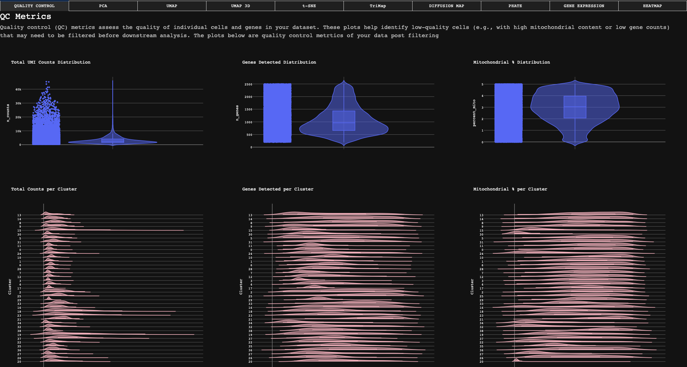
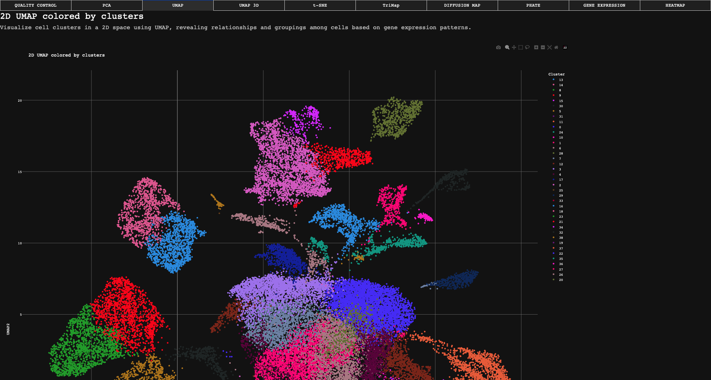
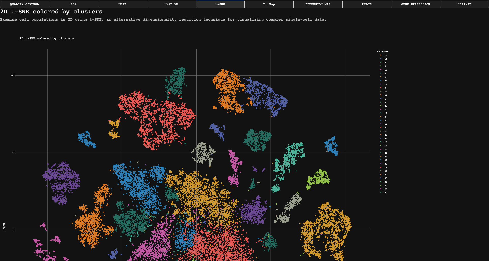
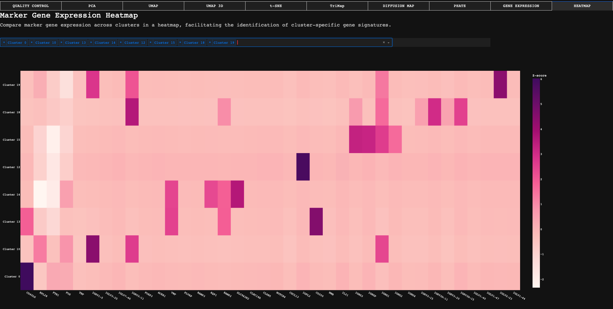

# 🧬 Single Cell RNA-seq Processing & Interactive Visualization Dashboard

This project provides a complete pipeline for single-cell RNA-seq preprocessing and visualization, enabling researchers to interactively explore quality control metrics, dimensionality reductions (UMAP, t-SNE, TriMap, Diffusion Map, PHATE), gene expression, and clustering results in an intuitive dashboard.

---

## 🚀 Features

- End-to-end **data preprocessing pipeline** using Scanpy and manifold learning techniques (UMAP, t-SNE, TriMap, PHATE, Diffusion Map)
- Interactive **Dash dashboard** with tabs for QC, PCA, UMAP (2D/3D), t-SNE, TriMap, DiffMap, PHATE, gene expression plots, and heatmaps
- Styled with a **modern dark UI**, and responsive layout
- Command-line **bash script** to automate processing and launch the app

---

## 📁 Project Structure

```
.
├── data/
│   ├── sample_data.h5ad          # Raw input data (user-provided)
│   └── processed_data.h5ad       # Generated processed dataset
├── app.py                        # Main Dash app entry point
├── dashboard.py                  # Dashboard page logic
├── single_cell_processing.py     # Scanpy-based data preprocessing script
├── execution.sh                  # Unified CLI to run processing or app
├── requirements.txt              # Python dependencies
└── README.md                     # You're here!
```

---

## 🛠️ Installation

```bash
# Clone this repository
git clone https://github.com/your-repo/Single_Cell_Pipeline
cd Single_Cell_Pipeline

# Create virtual environment
python -m venv venv
source venv/bin/activate

# Install dependencies
pip install -r requirements.txt
```

---

## ⚙️ Usage

### 1. Process the data

Ensure `data/sample_data.h5ad` exists in the `data/` directory.

```bash
bash execution.sh --process
```

This will generate `processed_data.h5ad` using the Scanpy preprocessing pipeline.

### 2. Launch the dashboard

Once the processed file is ready:

```bash
bash execution.sh
```

Open the app in your browser at `http://127.0.0.1:8050`.

---

## 📸 Screenshots

> ⚠️ Add your screenshots below after launching the app and exploring each tab:

### Dashboard Landing Page


### Quality Control Tab


### Dimensionality Reduction (UMAP, t-SNE, etc.)



### Gene Expression & Heatmap



---

## 🧪 Processing Pipeline Overview

The preprocessing script performs:

- Mitochondrial gene QC and filtering
- Normalization & log transformation
- Highly variable gene selection
- Scaling and PCA
- Clustering via Leiden
- Embeddings: UMAP (2D/3D), t-SNE, TriMap, DiffMap, PHATE
- Saves the result to `processed_data.h5ad`

Run from terminal:
```bash
python single_cell_processing.py
```

---

## 📦 Dependencies

Key packages include:

- `scanpy`, `anndata`, `numpy`, `pandas`, `scikit-learn`, `scipy`
- `plotly`, `dash`, `dash-bootstrap-components`, `flask`
- `trimap`, `phate`, `matplotlib`, `seaborn`

Install via:
```bash
pip install -r requirements.txt
```

---

## 🤝 Acknowledgments

- Built using [Scanpy](https://scanpy.readthedocs.io/en/stable/)
- Visualizations powered by [Dash](https://dash.plotly.com/)
- Embeddings from [TriMap](https://github.com/eamid/trimap), [PHATE](https://github.com/KrishnaswamyLab/PHATE)

---

## 📬 Contact

For questions or contributions, feel free to reach out or open an issue!

---
